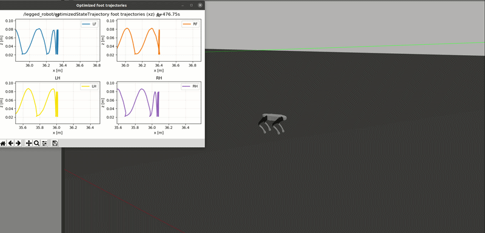

# legged_mpc_amp

[](LICENSE)

基于 NMPC + WBC 的四足机器人通用 AMP 数据生成器。封装了 Gazebo 键盘控制、全自动 AMP 录制和多种机器人导入接口。

## 🎬 效果演示



## 🚀 快速开始（一键编译）

```bash
# 1. 安装系统依赖（Ubuntu 20.04 + ROS Noetic）
sudo apt update
sudo apt install python3-catkin-tools python3-rosdep libeigen3-dev \
  libboost-all-dev liburdfdom-dev \
  ros-noetic-pinocchio ros-noetic-hpp-fcl

# 2. 编译整个工作空间
cd /path/to/legged_mpc_amp
source /opt/ros/noetic/setup.bash
bash setup.sh
```

## 💻 启动仿真

```bash
# 终端 1：启动 Gazebo
source env.sh go2
roslaunch legged_robot_description empty_world.launch

# 终端 2：启动键盘控制 + AMP 录制
source env.sh go2
roslaunch legged_controllers keyboard_control.launch \
  enable_amp_logging:=true \
  amp_log_dir:=$(pwd)/amp_data
```

启动后按 `i` 初始化，按 `1` 切换 trot 步态，按 `w/s` 控制前进/后退。

## 📦 核心功能

- **全自动 AMP 数据录制**：一键采集 1-2 分钟多样本运动数据
- **IsaacLab 格式导出**：`convert_amp_data_isaaclab.py` 直接输出 `.npz` 文件
- **足端轨迹可视化**：实时查看 MPC 优化出的足端轨迹（`foot_trajectory_plotter.py`）
- **多机器人支持**：Go1/Go2/A1/Aliengo/Lite3，接入方式参见[新机器人接入指南](docs/new_robot_setup.md)

## 🎮 键盘快捷键

| 按键 | 功能 |
|------|------|
| `i` | 初始化控制器 |
| `1` | 切换 trot 步态 |
| `w/s` | 增加/减小前进速度 |
| `a/d` | 增加/减小转向角速度 |
| `l` | 开始/停止 AMP 录制 |
| `0` | 切换到 stance |

## 📖 详细文档

- [完整编译与环境配置](docs/build_guide.md)
- [新四足机器人接入教程](docs/new_robot_setup.md)
- [AMP 数据采集与转换详解](docs/amp_data_guide.md)

## 🙏 致谢

本项目基于 [QiayuanLiao/legged_control](https://github.com/qiayuanl/legged_control.git) 构建，感谢原作者的杰出工作。修改和封装部分遵循 BSD 3-Clause 协议。

## ⭐️ 支持

如果这个项目对你有帮助，请点个 Star 支持一下！遇到问题欢迎提 Issue。
